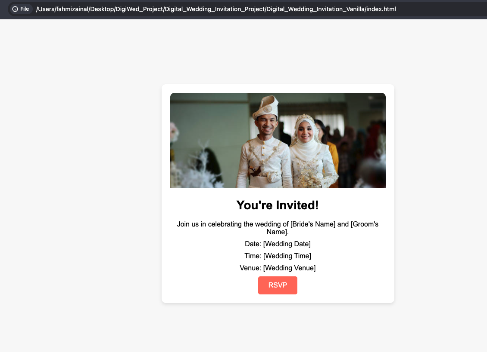
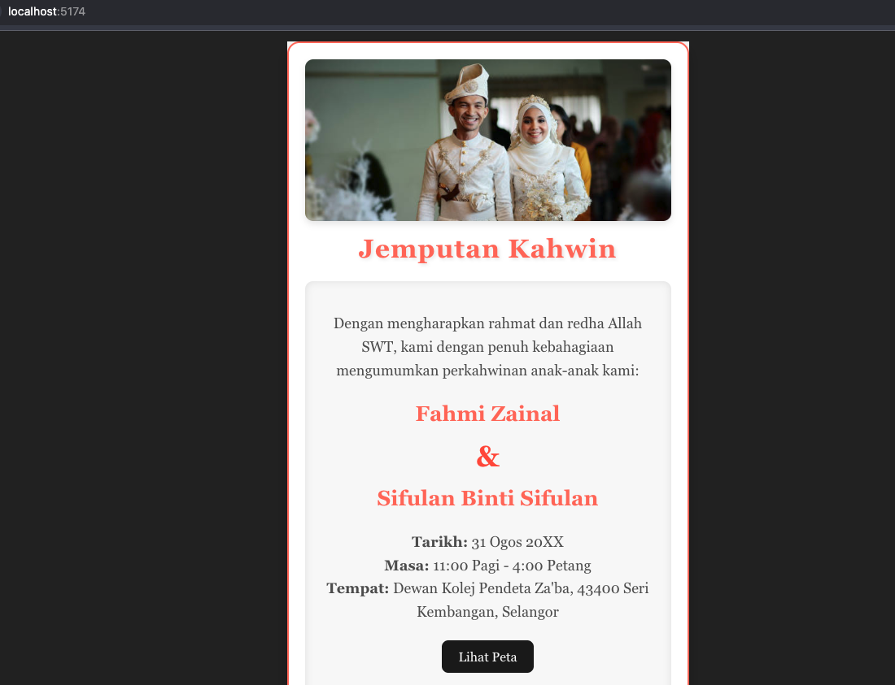
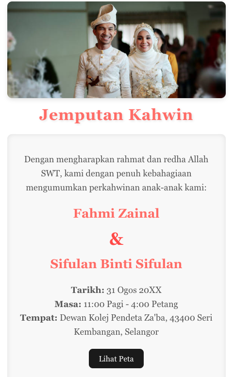
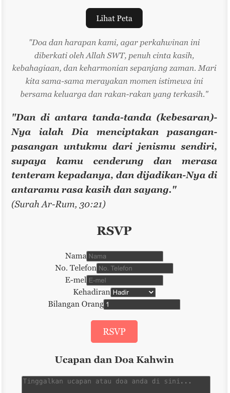
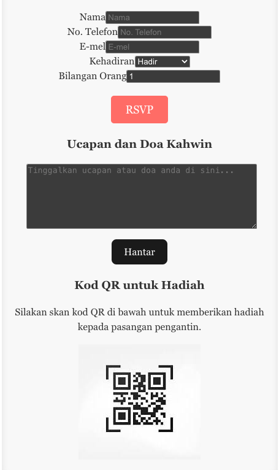

# Digital Wedding Invitation

**Craft and Share Your Special Day with Ease – Vanilla & React Versions Included**

---

<p align="center">
  
  
  
</p>

## Built With

- **HTML · CSS · JavaScript** (Vanilla)  
- **React · Vite** (React version)

---

## Overview

This repository contains two editions of a beautiful, responsive wedding invitation:

1. **Vanilla**  
   A zero-build, plain-JavaScript version — just open an HTML file in your browser.  
2. **React**  
   A modern, Vite-powered Single Page App with componentized UI and hot reload.

Both editions feature:

- A hero image banner  
- Invitation details (bride & groom names, date, time, venue)  
- A styled RSVP button  

---

## Demo Screenshots

### Vanilla Edition  
<div align="center">
  
  <p><em>Digital_Wedding_Invitation_Vanilla/index.html</em></p>
</div>

### React Edition (Local Dev)  
<div align="center">
  
  <p><em>Running at <code>npm run dev</code> → http://localhost:5174/</em></p>
</div>

### React Edition – Key Screens  
<table align="center">
  <tr>
    <td align="center">
      
      <p><em>Home / Hero Banner</em></p>
    </td>
    <td align="center">
      
      <p><em>RSVP Form Modal</em></p>
    </td>
    <td align="center">
      
      <p><em>Thank-You Confirmation</em></p>
    </td>
  </tr>
</table>

---

## Project Structure

```text
Digital_Wedding_Invitation_Project/
├── Digital_Wedding_Invitation_Vanilla/
│   ├── css/
│   │   └── style.css
│   ├── js/
│   │   └── script.js
│   ├── public/
│   │   └── images/
│   │       └── wedding_image.jpg
│   ├── index.html
│   ├── LICENSE
│   └── README.md        # ← this file for vanilla edition
└── digital-wedding-invitation-react/
    ├── public/          # contains vite.svg, index.html, assets
    ├── src/             # React components & styles
    ├── package.json
    ├── vite.config.js
    └── README.md        # ← this file for React edition
````

---

## Installation & Usage

### 1. Vanilla Edition

No build tools required:

```bash
cd Digital_Wedding_Invitation_Vanilla
# On macOS you can:
open index.html
# Or simply double-click the file in your Explorer/Finder
```

### 2. React Edition

Powered by Vite—hot reload included:

```bash
cd digital-wedding-invitation-react
npm install
npm run dev
```

Then open your browser to the address shown (e.g. `http://localhost:5174/`).

---

## Features

* 📱 **Responsive Design** – Looks great on mobile & desktop
* 🎨 **Custom Styles** – Easily tweak colors, fonts, and spacing
* 🚀 **Zero Deploy** (Vanilla) – Just upload to any static host (GitHub Pages, Netlify, etc.)
* ⚡ **Hot Reload** (React) – Instantly see code changes during development

---

## License

MIT © 2025 Fahmi Zainal
