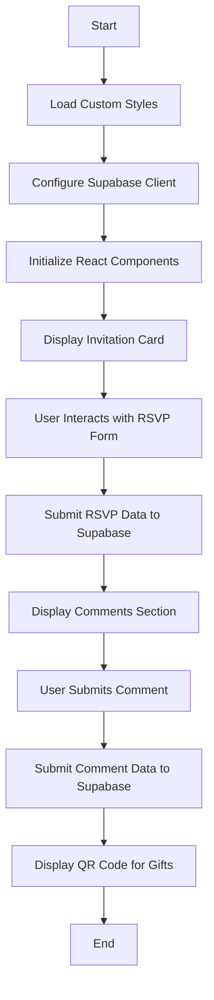

# **💍 Digital Wedding Invitation Project**

<!-- Badge to Visit Project -->
<div align="center">
    <a href="https://your-project-url.com">
        
    </a>
</div>

---

## **📄 Overview**

The **Digital Wedding Invitation Project** is a modern web application built with **React** and **Supabase**. This project allows users to create and manage digital wedding invitations, including RSVP forms, comments, and QR codes for gifts. It provides a seamless and interactive experience for both the hosts and the guests.

---

## **Table of Contents**

1. [🎯 Objectives](#-objectives)
2. [🔧 Technologies Used](#-technologies-used)
3. [📝 Directory Structure](#-directory-structure)
4. [🔍 Features](#-features)
5. [🔄 Project Workflow](#-project-workflow)
6. [🎉 Conclusion](#-conclusion)
7. [📚 References](#-references)
8. [📜 License](#-license)
9. [🗺️ Code Workflow](#-code-workflow)

---

## **🎯 Objectives**

- **🚀 Create a digital wedding invitation platform** with interactive features.
- **🔍 Allow guests to RSVP and leave comments** easily.
- **🎓 Integrate Supabase for backend services** including data storage and retrieval.

---

## **🔧 Technologies Used**


Other libraries:
- **Vite**: For fast development and build.
- **ESLint**: For code linting and quality.
- **React Hooks**: For state management.

---

## **📝 Directory Structure**

```plaintext
.
├── .env
├── .gitignore
├── eslint.config.js
├── index.html
├── package.json
├── public
│   ├── images
│   │   ├── qr_code.jpeg
│   │   └── wedding_image.jpg
│   └── vite.svg
├── README.md              # Project documentation
├── src
│   ├── App.css
│   ├── App.jsx
│   ├── assets
│   │   └── react.svg
│   ├── components
│   │   ├── CommentSection.jsx
│   │   ├── GoogleMap.jsx
│   │   ├── InvitationCard.css
│   │   ├── InvitationCard.jsx
│   │   ├── QRCodePlaceholder.jsx
│   │   ├── RSVPForm.css
│   │   └── RSVPForm.jsx
│   ├── index.css
│   ├── main.jsx
│   └── utils
│       └── supabaseClient.js
└── vite.config.js
```

---

## **🔍 Features**

### 1. **Interactive Invitation Card**
- Display a beautifully styled wedding invitation card with images and details.

### 2. **RSVP Form**
- Allow guests to RSVP and specify the number of attendees.

### 3. **Comment Section**
- Guests can leave comments and well-wishes for the couple.

### 4. **QR Code for Gifts**
- Provide a QR code for guests to scan and send gifts.

### 5. **Google Map Integration**
- Show the wedding venue location on Google Maps.

---

## **🔄 Project Workflow**

1. **🌐 Environment Setup**:
   - Install required libraries:

     ```bash
     npm install
     ```

   - Launch the app locally:

     ```bash
     npm run dev
     ```

2. **🔧 Backend Integration**:
   - Set up Supabase project and configure `.env` file with Supabase keys.
   - Use Supabase for storing RSVP and comment data.

3. **🚀 Application Development**:
   - Develop React components for the invitation card, RSVP form, and comment section.
   - Integrate Google Maps and QR code functionalities.

4. **🎮 User Interaction**:
   - Users can view the invitation, RSVP, leave comments, and scan QR codes seamlessly.

5. **🔄 Continuous Improvement**:
   - Add new features, optimize performance, and improve user experience.

---

## **🗺️ Code Workflow**

The following Mermaid diagram illustrates the workflow of the code:



### How to Use Mermaid Diagrams

To render Mermaid diagrams in your Markdown files, you can use a Markdown viewer that supports Mermaid, such as:

- **Visual Studio Code** with the **Markdown Preview Mermaid Support** extension.
- **Typora**, a Markdown editor with built-in Mermaid support.
- **GitHub** (with Mermaid syntax highlighting) or **GitLab** (with Mermaid support enabled).

Simply copy the Mermaid code block into your Markdown file, and it will be rendered as a diagram when viewed with a compatible Markdown viewer.

---

## **🎉 Conclusion**

The **Digital Wedding Invitation Project** is a practical demonstration of modern web development using React and Supabase. It provides a seamless and interactive experience for managing wedding invitations, RSVPs, and comments. This project showcases the integration of frontend and backend technologies to create a user-friendly application.

---

## **📚 References**

- [React Documentation](https://reactjs.org/docs/getting-started.html)
- [Supabase Documentation](https://supabase.io/docs)
- [Vite Documentation](https://vitejs.dev/guide/)
- [ESLint Documentation](https://eslint.org/docs/user-guide/getting-started)

---

## **📜 License**

**Fahmi Zainal Custom License**
Unauthorized copying, distribution, or modification of this project is prohibited. For inquiries, contact the project owner.
